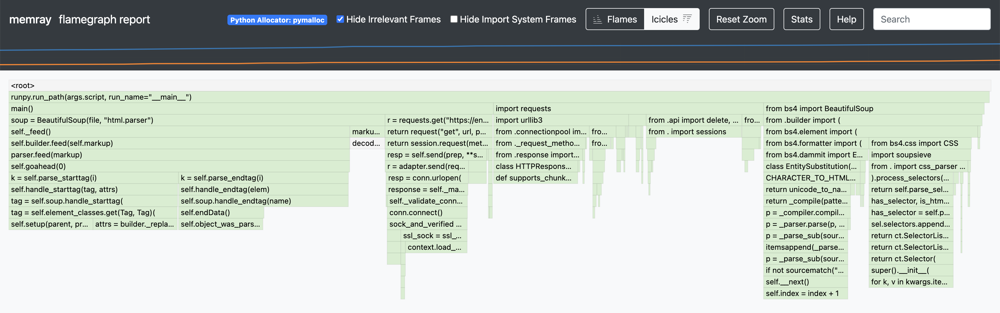

# Python Profiling

## Setup

```bash
pyenv install $(cat .python-version)
pyenv local
python -m venv .venv
source .venv/bin/activate
pip install -r requirements.txt
```

## Run

Run the following to show the timings of the different profiling methods:

```
$ ./timing.sh
```

Here are the results of the timing from one run:

| Method       | Real Time | User Time | System Time |
|--------------|-----------|-----------|-------------|
| No profiling | 0m0.344s  | 0m0.157s  | 0m0.017s    |
| guppy3       | 0m0.525s  | 0m0.343s  | 0m0.018s    |
| psutil       | 0m0.349s  | 0m0.149s  | 0m0.016s    |
| memray       | 0m0.686s  | 0m0.360s  | 0m0.065s    |
| pyinstrument | 0m0.496s  | 0m0.310s  | 0m0.024s    |
| cProfile     | 0m0.493s  | 0m0.307s  | 0m0.018s    |
| tracemalloc  | 0m0.592s  | 0m0.432s  | 0m0.018s    |

### [cProfile](https://docs.python.org/3/library/profile.html#module-cProfile)

```
$ python -m cProfile -o profile.out program.py

$ python -m pstats profile.out
profile.out% sort cumulative
profile.out% stats 10
```

<details>
<summary>Output</summary>

```
Welcome to the profile statistics browser.
profile.out% sort cumulative
profile.out% stats 10
Mon Feb 26 23:51:19 2024    profile.out

         658389 function calls (640523 primitive calls) in 0.484 seconds

   Ordered by: cumulative time
   List reduced from 1926 to 10 due to restriction <10>

   ncalls  tottime  percall  cumtime  percall filename:lineno(function)
    151/1    0.001    0.000    0.484    0.484 {built-in method builtins.exec}
        1    0.000    0.000    0.484    0.484 program.py:1(<module>)
        1    0.000    0.000    0.307    0.307 program.py:7(main)
        1    0.000    0.000    0.180    0.180 /Users/rudolfo/Workspace/profiling-code/python/.venv/lib/python3.11/site-packages/requests/api.py:62(get)
        1    0.000    0.000    0.180    0.180 /Users/rudolfo/Workspace/profiling-code/python/.venv/lib/python3.11/site-packages/requests/api.py:14(request)
        1    0.000    0.000    0.180    0.180 /Users/rudolfo/Workspace/profiling-code/python/.venv/lib/python3.11/site-packages/requests/sessions.py:502(request)
    202/4    0.001    0.000    0.178    0.044 <frozen importlib._bootstrap>:1165(_find_and_load)
    201/4    0.000    0.000    0.178    0.044 <frozen importlib._bootstrap>:1120(_find_and_load_unlocked)
    176/4    0.000    0.000    0.177    0.044 <frozen importlib._bootstrap>:666(_load_unlocked)
    149/4    0.000    0.000    0.177    0.044 <frozen importlib._bootstrap_external>:934(exec_module)
```
</details>

### [tracemalloc](https://docs.python.org/3/library/tracemalloc.html)

```
$ python run_tracemalloc.py
```

<details>
<summary>Output</summary>

```
[('lunar', 21), ('lander', 17), ('Nova-C', 16), ('landing', 11), ('Intuitive', 10), ('with', 10), ('will', 10), ('NASA', 9), ('that', 9), ('Machines', 7)]
[ Top 10 differences ]
/Users/rudolfo/Workspace/profiling-code/python/.venv/lib/python3.11/site-packages/bs4/__init__.py:749: size=988 KiB (+988 KiB), count=8219 (+8219), average=123 B
/Users/rudolfo/Workspace/profiling-code/python/.venv/lib/python3.11/site-packages/bs4/element.py:175: size=966 KiB (+966 KiB), count=5888 (+5888), average=168 B
/Users/rudolfo/Workspace/profiling-code/python/.venv/lib/python3.11/site-packages/bs4/element.py:952: size=393 KiB (+393 KiB), count=5890 (+5890), average=68 B
/Users/rudolfo/.pyenv/versions/3.11.5/lib/python3.11/html/parser.py:323: size=235 KiB (+235 KiB), count=3379 (+3379), average=71 B
/Users/rudolfo/.pyenv/versions/3.11.5/lib/python3.11/html/parser.py:326: size=204 KiB (+204 KiB), count=3893 (+3893), average=54 B
/Users/rudolfo/Workspace/profiling-code/python/.venv/lib/python3.11/site-packages/bs4/element.py:1252: size=193 KiB (+193 KiB), count=3081 (+3081), average=64 B
/Users/rudolfo/Workspace/profiling-code/python/.venv/lib/python3.11/site-packages/bs4/builder/__init__.py:321: size=169 KiB (+169 KiB), count=3529 (+3529), average=49 B
/Users/rudolfo/Workspace/profiling-code/python/.venv/lib/python3.11/site-packages/bs4/element.py:1276: size=168 KiB (+168 KiB), count=3080 (+3080), average=56 B
/Users/rudolfo/.pyenv/versions/3.11.5/lib/python3.11/html/parser.py:313: size=154 KiB (+154 KiB), count=3082 (+3082), average=51 B
/Users/rudolfo/Workspace/profiling-code/python/.venv/lib/python3.11/site-packages/bs4/builder/_htmlparser.py:115: size=132 KiB (+132 KiB), count=2119 (+2119), average=64 B
```
</details>

### [Memray](https://bloomberg.github.io/memray/overview.html)

```
$ memray run program.py
$ memray flamegraph memray-program.py.*.bin
$ open memray-flamegraph-program.py.*.html
```

<details>
<summary>Output</summary>


</details>

### [psutil](https://psutil.readthedocs.io/en/latest/)

```
$ python run_psutil.py
```

<details>
<summary>Output</summary>

```
Initial
pcputimes(user=0.089062752, system=0.022834584, children_user=0.0, children_system=0.0)
pmem(rss=28999680, vms=418850439168, pfaults=2272, pageins=25)
[('lunar', 21), ('lander', 17), ('Nova-C', 16), ('landing', 11), ('Intuitive', 10), ('with', 10), ('will', 10), ('NASA', 9), ('that', 9), ('Machines', 7)]
After
pcputimes(user=0.15308312, system=0.02816604, children_user=0.0, children_system=0.0)
pmem(rss=38912000, vms=418856648704, pfaults=2897, pageins=25)
```
</details>

### [guppy3](https://github.com/zhuyifei1999/guppy3)

```
$ python run_guppy3.py
```

<details>
<summary>Output</summary>

```
Initial
Partition of a set of 109798 objects. Total size = 14652386 bytes.
 Index  Count   %     Size   % Cumulative  % Kind (class / dict of class)
     0  36699  33  3347979  23   3347979  23 str
     1   6616   6  2501840  17   5849819  40 types.CodeType
     2  22154  20  1597088  11   7446907  51 tuple
     3   1143   1  1300488   9   8747395  60 type
     4  13397  12  1224487   8   9971882  68 bytes
     5   6174   6   938448   6  10910330  74 function
     6   1190   1   728760   5  11639090  79 dict (no owner)
     7   1143   1   406088   3  12045178  82 dict of type
     8    270   0   314112   2  12359290  84 dict of module
     9   6385   6   194024   1  12553314  86 int
<314 more rows. Type e.g. '_.more' to view.>
[('lunar', 21), ('lander', 17), ('Nova-C', 16), ('landing', 11), ('Intuitive', 10), ('with', 10), ('will', 10), ('NASA', 9), ('that', 9), ('Machines', 7)]
After
Partition of a set of 110443 objects. Total size = 14745125 bytes.
 Index  Count   %     Size   % Cumulative  % Kind (class / dict of class)
     0  36868  33  3360831  23   3360831  23 str
     1   6648   6  2517608  17   5878439  40 types.CodeType
     2  22276  20  1606368  11   7484807  51 tuple
     3   1152   1  1314912   9   8799719  60 type
     4  13460  12  1232402   8  10032121  68 bytes
     5   6205   6   943160   6  10975281  74 function
     6   1192   1   729808   5  11705089  79 dict (no owner)
     7   1152   1   408288   3  12113377  82 dict of type
     8    273   0   315872   2  12429249  84 dict of module
     9   6403   6   194588   1  12623837  86 int
<322 more rows. Type e.g. '_.more' to view.>
```
</details>
