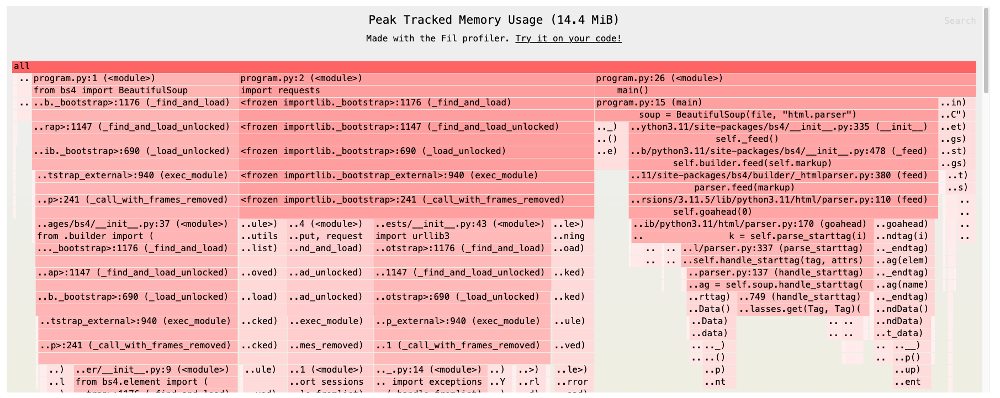

# Python Profiling

The tools used for profiling are maintained as of February 2024.

The output of each profiling tool may require filtering to produce useful information.

## Setup

```bash
pyenv install $(cat .python-version)
pyenv local
python -m venv .venv
source .venv/bin/activate
pip install -r requirements.txt
```

## Run

Run the following to show the timings of the different profiling methods:

```
$ ./timing.sh
```

Here are the results of the timing from one run:

| Method       | Real Time | User Time | System Time |
|--------------|-----------|-----------|-------------|
| No profiling | 0m0.344s  | 0m0.157s  | 0m0.017s    |
| guppy3       | 0m0.525s  | 0m0.343s  | 0m0.018s    |
| psutil       | 0m0.349s  | 0m0.149s  | 0m0.016s    |
| memray       | 0m0.686s  | 0m0.360s  | 0m0.065s    |
| pyinstrument | 0m0.496s  | 0m0.310s  | 0m0.024s    |
| cProfile     | 0m0.493s  | 0m0.307s  | 0m0.018s    |
| tracemalloc  | 0m0.592s  | 0m0.432s  | 0m0.018s    |
| yappi        | 0m0.965s  | 0m0.435s  | 0m0.392s    |
| filprofiler  | 0m2.414s  | 0m2.135s  | 0m0.128s    |

### [cProfile](https://docs.python.org/3/library/profile.html#module-cProfile)

```
$ python -m cProfile -o profile.out program.py

$ python -m pstats profile.out
profile.out% sort cumulative
profile.out% stats 10
```

<details>
<summary>Output</summary>

```
Welcome to the profile statistics browser.
profile.out% sort cumulative
profile.out% stats 10
Mon Feb 26 23:51:19 2024    profile.out

         658389 function calls (640523 primitive calls) in 0.484 seconds

   Ordered by: cumulative time
   List reduced from 1926 to 10 due to restriction <10>

   ncalls  tottime  percall  cumtime  percall filename:lineno(function)
    151/1    0.001    0.000    0.484    0.484 {built-in method builtins.exec}
        1    0.000    0.000    0.484    0.484 program.py:1(<module>)
        1    0.000    0.000    0.307    0.307 program.py:7(main)
        1    0.000    0.000    0.180    0.180 /Users/rudolfo/Workspace/profiling-code/python/.venv/lib/python3.11/site-packages/requests/api.py:62(get)
        1    0.000    0.000    0.180    0.180 /Users/rudolfo/Workspace/profiling-code/python/.venv/lib/python3.11/site-packages/requests/api.py:14(request)
        1    0.000    0.000    0.180    0.180 /Users/rudolfo/Workspace/profiling-code/python/.venv/lib/python3.11/site-packages/requests/sessions.py:502(request)
    202/4    0.001    0.000    0.178    0.044 <frozen importlib._bootstrap>:1165(_find_and_load)
    201/4    0.000    0.000    0.178    0.044 <frozen importlib._bootstrap>:1120(_find_and_load_unlocked)
    176/4    0.000    0.000    0.177    0.044 <frozen importlib._bootstrap>:666(_load_unlocked)
    149/4    0.000    0.000    0.177    0.044 <frozen importlib._bootstrap_external>:934(exec_module)
```
</details>

### [tracemalloc](https://docs.python.org/3/library/tracemalloc.html)

```
$ python run_tracemalloc.py
```

<details>
<summary>Output</summary>

```
[('lunar', 21), ('lander', 17), ('Nova-C', 16), ('landing', 11), ('Intuitive', 10), ('with', 10), ('will', 10), ('NASA', 9), ('that', 9), ('Machines', 7)]
[ Top 10 differences ]
/Users/rudolfo/Workspace/profiling-code/python/.venv/lib/python3.11/site-packages/bs4/__init__.py:749: size=988 KiB (+988 KiB), count=8219 (+8219), average=123 B
/Users/rudolfo/Workspace/profiling-code/python/.venv/lib/python3.11/site-packages/bs4/element.py:175: size=966 KiB (+966 KiB), count=5888 (+5888), average=168 B
/Users/rudolfo/Workspace/profiling-code/python/.venv/lib/python3.11/site-packages/bs4/element.py:952: size=393 KiB (+393 KiB), count=5890 (+5890), average=68 B
/Users/rudolfo/.pyenv/versions/3.11.5/lib/python3.11/html/parser.py:323: size=235 KiB (+235 KiB), count=3379 (+3379), average=71 B
/Users/rudolfo/.pyenv/versions/3.11.5/lib/python3.11/html/parser.py:326: size=204 KiB (+204 KiB), count=3893 (+3893), average=54 B
/Users/rudolfo/Workspace/profiling-code/python/.venv/lib/python3.11/site-packages/bs4/element.py:1252: size=193 KiB (+193 KiB), count=3081 (+3081), average=64 B
/Users/rudolfo/Workspace/profiling-code/python/.venv/lib/python3.11/site-packages/bs4/builder/__init__.py:321: size=169 KiB (+169 KiB), count=3529 (+3529), average=49 B
/Users/rudolfo/Workspace/profiling-code/python/.venv/lib/python3.11/site-packages/bs4/element.py:1276: size=168 KiB (+168 KiB), count=3080 (+3080), average=56 B
/Users/rudolfo/.pyenv/versions/3.11.5/lib/python3.11/html/parser.py:313: size=154 KiB (+154 KiB), count=3082 (+3082), average=51 B
/Users/rudolfo/Workspace/profiling-code/python/.venv/lib/python3.11/site-packages/bs4/builder/_htmlparser.py:115: size=132 KiB (+132 KiB), count=2119 (+2119), average=64 B
```
</details>

### [Memray](https://bloomberg.github.io/memray/overview.html)

```
$ memray run program.py
$ memray flamegraph memray-program.py.*.bin
$ open memray-flamegraph-program.py.*.html
```

<details>
<summary>Output</summary>


</details>

### [psutil](https://psutil.readthedocs.io/en/latest/)

```
$ python run_psutil.py
```

<details>
<summary>Output</summary>

```
Initial
pcputimes(user=0.089062752, system=0.022834584, children_user=0.0, children_system=0.0)
pmem(rss=28999680, vms=418850439168, pfaults=2272, pageins=25)
[('lunar', 21), ('lander', 17), ('Nova-C', 16), ('landing', 11), ('Intuitive', 10), ('with', 10), ('will', 10), ('NASA', 9), ('that', 9), ('Machines', 7)]
After
pcputimes(user=0.15308312, system=0.02816604, children_user=0.0, children_system=0.0)
pmem(rss=38912000, vms=418856648704, pfaults=2897, pageins=25)
```
</details>

### [guppy3](https://github.com/zhuyifei1999/guppy3)

```
$ python run_guppy3.py
```

<details>
<summary>Output</summary>

```
Initial
Partition of a set of 109798 objects. Total size = 14652386 bytes.
 Index  Count   %     Size   % Cumulative  % Kind (class / dict of class)
     0  36699  33  3347979  23   3347979  23 str
     1   6616   6  2501840  17   5849819  40 types.CodeType
     2  22154  20  1597088  11   7446907  51 tuple
     3   1143   1  1300488   9   8747395  60 type
     4  13397  12  1224487   8   9971882  68 bytes
     5   6174   6   938448   6  10910330  74 function
     6   1190   1   728760   5  11639090  79 dict (no owner)
     7   1143   1   406088   3  12045178  82 dict of type
     8    270   0   314112   2  12359290  84 dict of module
     9   6385   6   194024   1  12553314  86 int
<314 more rows. Type e.g. '_.more' to view.>
[('lunar', 21), ('lander', 17), ('Nova-C', 16), ('landing', 11), ('Intuitive', 10), ('with', 10), ('will', 10), ('NASA', 9), ('that', 9), ('Machines', 7)]
After
Partition of a set of 110443 objects. Total size = 14745125 bytes.
 Index  Count   %     Size   % Cumulative  % Kind (class / dict of class)
     0  36868  33  3360831  23   3360831  23 str
     1   6648   6  2517608  17   5878439  40 types.CodeType
     2  22276  20  1606368  11   7484807  51 tuple
     3   1152   1  1314912   9   8799719  60 type
     4  13460  12  1232402   8  10032121  68 bytes
     5   6205   6   943160   6  10975281  74 function
     6   1192   1   729808   5  11705089  79 dict (no owner)
     7   1152   1   408288   3  12113377  82 dict of type
     8    273   0   315872   2  12429249  84 dict of module
     9   6403   6   194588   1  12623837  86 int
<322 more rows. Type e.g. '_.more' to view.>
```
</details>

### [yappi](https://github.com/sumerc/yappi/)

```
$ python run_yappi.py
```

<details>
<summary>Output</summary>

```
[('lunar', 21), ('lander', 17), ('Nova-C', 16), ('landing', 11), ('Intuitive', 10), ('with', 10), ('will', 10), ('NASA', 9), ('that', 9), ('Machines', 7)]

Clock type: CPU
Ordered by: totaltime, desc

name                                  ncall  tsub      ttot      tavg      
..ling-code/python/program.py:7 main  1      0.002172  0.655153  0.655153
..it__.py:122 BeautifulSoup.__init__  1      0.000051  0.583077  0.583077
.._init__.py:471 BeautifulSoup._feed  1      0.000008  0.582719  0.582719
...py:372 HTMLParserTreeBuilder.feed  1      0.000013  0.582708  0.582708
..y:103 BeautifulSoupHTMLParser.feed  1      0.000020  0.582664  0.582664
..33 BeautifulSoupHTMLParser.goahead  2      0.057082  0.582646  0.291323
..tifulSoupHTMLParser.parse_starttag  3082   0.061465  0.303520  0.000098
..ifulSoupHTMLParser.handle_starttag  3082   0.018228  0.172833  0.000056
..autifulSoupHTMLParser.parse_endtag  2961   0.025883  0.137478  0.000046
..:722 BeautifulSoup.handle_starttag  3082   0.018715  0.137314  0.000045
..utifulSoupHTMLParser.handle_endtag  3082   0.008075  0.096062  0.000031
..py:763 BeautifulSoup.handle_endtag  3076   0.009817  0.087978  0.000029
..nit__.py:586 BeautifulSoup.endData  6171   0.020953  0.087783  0.000014
..ent.py:1199 BeautifulSoup.__init__  3083   0.019516  0.056987  0.000018
.. BeautifulSoupHTMLParser.updatepos  12452  0.025082  0.035902  0.000003
..te-packages/requests/api.py:62 get  1      0.000010  0.034210  0.034210
..ackages/requests/api.py:14 request  1      0.000018  0.034200  0.034200
..ts/sessions.py:502 Session.request  1      0.000027  0.033905  0.033905
..t__.py:688 BeautifulSoup._popToTag  3076   0.014567  0.031591  0.000010
..20 BeautifulSoup.object_was_parsed  2945   0.014938  0.031312  0.000011
..ent.py:2013 BeautifulSoup.find_all  1      0.000013  0.029662  0.029662
..ent.py:792 BeautifulSoup._find_all  1      0.000017  0.029648  0.029648
..element.py:2422 ResultSet.__init__  1      0.000028  0.029576  0.029576
..kages/bs4/element.py:824 <genexpr>  24     0.015143  0.029548  0.001231
..eplace_cdata_list_attribute_values  2119   0.015352  0.026458  0.000012
..ackages/bs4/element.py:943 __new__  2945   0.012685  0.023243  0.000008
..uests/sessions.py:673 Session.send  1      0.000037  0.022512  0.022512
..MLParser.check_for_whole_start_tag  3082   0.010255  0.018228  0.000006
..nit__.py:572 BeautifulSoup.pushTag  3083   0.012018  0.017817  0.000006
..s/adapters.py:434 HTTPAdapter.send  1      0.000039  0.017068  0.017068
..eautifulSoupHTMLParser.handle_data  3134   0.006601  0.015850  0.000005
..element.py:156 BeautifulSoup.setup  8973   0.013698  0.013698  0.000002
..py:598 HTTPSConnectionPool.urlopen  1      0.000040  0.012440  0.012440
.. HTTPSConnectionPool._make_request  1      0.000039  0.011761  0.011761
..init__.py:558 BeautifulSoup.popTag  3082   0.008353  0.011245  0.000004
..523 BeautifulSoup.string_container  2945   0.006777  0.009575  0.000003
..ement.py:1371 Tag.is_empty_element  3082   0.006415  0.009303  0.000003
.._.py:773 BeautifulSoup.handle_data  3140   0.006391  0.009266  0.000003
..Session.merge_environment_settings  1      0.000037  0.008096  0.008096
..s/utils.py:824 get_environ_proxies  1      0.000006  0.007984  0.007984
..HTTPSConnectionPool._validate_conn  1      0.000013  0.007557  0.007557
..ion.py:614 HTTPSConnection.connect  1      0.000026  0.007541  0.007541
..ssl_wrap_socket_and_match_hostname  1      0.000035  0.007094  0.007094
...py:2062 BeautifulSoup.descendants  6511   0.006641  0.006681  0.000001
..y:648 BeautifulSoup._linkage_fixer  1434   0.004995  0.006359  0.000004
..utils.py:764 should_bypass_proxies  1      0.000019  0.006326  0.006326
..3.11/html/__init__.py:122 unescape  3880   0.004036  0.006274  0.000002
..rllib/request.py:2649 proxy_bypass  1      0.000005  0.006214  0.006214
..3/util/ssl_.py:392 ssl_wrap_socket  1      0.000013  0.005817  0.005817
..kies.py:124 extract_cookies_to_jar  2      0.000019  0.005478  0.002739
.. RequestsCookieJar.extract_cookies  2      0.000079  0.005408  0.002704
..y:2635 proxy_bypass_macosx_sysconf  1      0.000010  0.004633  0.004633
..on3.11/re/__init__.py:272 _compile  18     0.000150  0.004501  0.000250
..on3.11/re/_compiler.py:738 compile  6      0.000077  0.004106  0.000684
..tifulSoupHTMLParser.handle_charref  176    0.001017  0.004059  0.000023
..py:440 HTTPSConnection.getresponse  1      0.000037  0.003592  0.003592
..hon3.11/re/__init__.py:225 compile  16     0.000043  0.003546  0.000222
..:2567 _proxy_bypass_macosx_sysconf  1      0.000029  0.003442  0.003442
...py:294 HTTPAdapter.build_response  1      0.000021  0.003427  0.003427
..erTreeBuilder.set_up_substitutions  3083   0.003173  0.003413  0.000001
..ons.py:459 Session.prepare_request  1      0.000029  0.003258  0.003258
..est.py:2499 getproxies_environment  2      0.000272  0.003174  0.001587
..erTreeBuilder.can_be_empty_element  3083   0.003168  0.003168  0.000001
..:36 BeautifulSoupHTMLParser.getpos  3082   0.003138  0.003138  0.000001
..fulSoupHTMLParser.clear_cdata_mode  2961   0.003059  0.003059  0.000001
..ctions_abc>:859 ItemsView.__iter__  172    0.000527  0.002968  0.000017
..599 RequestsCookieJar.make_cookies  2      0.000052  0.002912  0.001456
..s/bs4/element.py:1586 Tag.__bool__  3082   0.002875  0.002875  0.000001
..sts/models.py:887 Response.content  2      0.000014  0.002752  0.001376
..es/bs4/element.py:996 Doctype.name  2945   0.002704  0.002704  0.000001
..es/requests/models.py:812 generate  23     0.000080  0.002689  0.000117
..es/bs4/element.py:273 Tag.get_text  23     0.000081  0.002676  0.000116
..sponse.py:1021 HTTPResponse.stream  23     0.000111  0.002607  0.000113
..ages/bs4/element.py:292 <listcomp>  23     0.000301  0.002566  0.000112
..ib._bootstrap>:1165 _find_and_load  3/2    0.000047  0.002524  0.000841
..y:1334 HTTPSConnection.getresponse  1      0.000015  0.002505  0.002505
..p/client.py:311 HTTPResponse.begin  1      0.000031  0.002457  0.002457
..trap>:1120 _find_and_load_unlocked  3/2    0.000022  0.002397  0.000799
../response.py:899 HTTPResponse.read  22     0.000193  0.002371  0.000108
..4/element.py:1417 Tag._all_strings  281    0.001265  0.002265  0.000008
...py:949 DefaultCookiePolicy.set_ok  10     0.000228  0.002232  0.000223
..python3.11/re/_parser.py:972 parse  6      0.000053  0.002154  0.000359
..n3.11/re/_parser.py:449 _parse_sub  12/6   0.000137  0.002029  0.000169
..1/http/client.py:224 parse_headers  1      0.000017  0.001985  0.001985
..tifulSoupHTMLParser.set_cdata_mode  13     0.000064  0.001974  0.000152
..quests/utils.py:199 get_netrc_auth  1      0.000029  0.001926  0.001926
..ython3.11/re/_parser.py:509 _parse  12/6   0.000581  0.001893  0.000158
..lib._bootstrap>:666 _load_unlocked  3/2    0.000027  0.001869  0.000623
..thon3.11/re/_compiler.py:571 _code  6      0.000044  0.001800  0.000300
<frozen os>:674 _Environ.__getitem__  163    0.000505  0.001777  0.000011
..>:934 SourceFileLoader.exec_module  3/2    0.000020  0.001673  0.000558
..email/parser.py:59 Parser.parsestr  1      0.000009  0.001658  0.001658
../urllib/request.py:2662 getproxies  1      0.000003  0.001652  0.001652
..11/email/parser.py:41 Parser.parse  1      0.000017  0.001649  0.001649
..ml/__init__.py:91 _replace_charref  415    0.000987  0.001517  0.000004
../feedparser.py:171 FeedParser.feed  1      0.000009  0.001472  0.001472
..rser.py:176 FeedParser._call_parse  2      0.000025  0.001448  0.000724
..lSoupHTMLParser.handle_startendtag  20     0.000058  0.001447  0.000072
..parser.py:216 FeedParser._parsegen  2      0.000168  0.001423  0.000712
..sCookieJar._cookies_from_attrs_set  4      0.000056  0.001330  0.000333
..on3.11/re/_compiler.py:37 _compile  23/6   0.000538  0.001275  0.000055
..rap>:233 _call_with_frames_removed  6/4    0.000019  0.001230  0.000205
..ssl_.py:216 create_urllib3_context  1      0.000039  0.001192  0.001192
..lib/python3.11/netrc.py:1 <module>  1      0.000005  0.001111  0.001111
..tCookiePolicy.set_ok_verifiability  10     0.000037  0.001108  0.000111
../ssl_.py:493 _ssl_wrap_socket_impl  1      0.000004  0.001099  0.001099
../ssl.py:511 SSLContext.wrap_socket  1      0.000010  0.001095  0.001095
..lib/python3.11/ssl.py:1018 _create  1      0.000033  0.001085  0.001085
..tempfile.py:522 NamedTemporaryFile  1      0.000020  0.001080  0.001080
..ookieJar._cookie_from_cookie_tuple  10     0.000216  0.001046  0.000105
../cookiejar.py:466 parse_ns_headers  2      0.000476  0.001038  0.000519
..tp/cookiejar.py:726 is_third_party  10     0.000079  0.001026  0.000103
..ython3.11/re/__init__.py:163 match  2      0.000007  0.001008  0.000504
..ssl.py:1372 SSLSocket.do_handshake  1      0.000011  0.000956  0.000956
..ngs/__init__.py:71 search_function  2      0.000026  0.000933  0.000466
...py:331 HTTPAdapter.get_connection  1      0.000012  0.000931  0.000931
..els.py:352 PreparedRequest.prepare  1      0.000027  0.000888  0.000888
<frozen os>:760 decode                301    0.000599  0.000880  0.000003
<frozen os>:756 encode                163    0.000504  0.000821  0.000005
..57 PoolManager.connection_from_url  1      0.000007  0.000807  0.000807
..1/weakref.py:585 finalize.__call__  1      0.000006  0.000785  0.000785
../lib/python3.11/ssl.py:492 __new__  1      0.000007  0.000779  0.000779
..ol.py:1178 _close_pool_connections  1      0.000022  0.000778  0.000778
..1/tempfile.py:114 _sanitize_params  1      0.000008  0.000770  0.000770
..onse.py:847 HTTPResponse._raw_read  5      0.000068  0.000764  0.000153
..hon3.11/tempfile.py:297 gettempdir  1      0.000006  0.000759  0.000759
..py:40 CaseInsensitiveDict.__init__  6      0.000022  0.000752  0.000125
..bc>:941 CaseInsensitiveDict.update  8      0.000153  0.000750  0.000094
..on3.11/tempfile.py:285 _gettempdir  1      0.000014  0.000744  0.000744
..ortlib._bootstrap>:1054 _find_spec  3      0.000055  0.000736  0.000245
..mpfile.py:183 _get_default_tempdir  1      0.000036  0.000728  0.000728
<frozen os>:697 _Environ.__iter__     152    0.000299  0.000728  0.000005
..http/cookiejar.py:620 request_host  20     0.000147  0.000715  0.000036
../urllib3/util/url.py:369 parse_url  3      0.000051  0.000704  0.000235
..r.py:469 FeedParser._parse_headers  1      0.000172  0.000686  0.000686
..n3.11/urllib/parse.py:374 urlparse  40     0.000269  0.000680  0.000017
..11/urllib/parse.py:1129 _splitport  1      0.000005  0.000660  0.000660
.._collections_abc>:771 _Environ.get  66     0.000209  0.000608  0.000009
..b/python3.11/fnmatch.py:19 fnmatch  1      0.000006  0.000603  0.000603
..thon3.11/fnmatch.py:64 fnmatchcase  1      0.000005  0.000592  0.000592
...11/fnmatch.py:38 _compile_pattern  1      0.000011  0.000586  0.000586
../http/cookiejar.py:677 escape_path  20     0.000082  0.000582  0.000029
..al>:1007 SourceFileLoader.get_code  3      0.000056  0.000580  0.000193
..l/url.py:227 _encode_invalid_chars  4      0.000323  0.000577  0.000144
..py:311 Compat32.header_fetch_parse  40     0.000108  0.000559  0.000014
..ncodings/cp1252.py:14 Codec.decode  176    0.000377  0.000558  0.000003
..bootstrap_external>:1496 find_spec  3      0.000013  0.000554  0.000185
..ail/message.py:489 HTTPMessage.get  8      0.000233  0.000551  0.000069
..7 PoolManager.connection_from_host  1      0.000013  0.000550  0.000550
..bootstrap_external>:1464 _get_spec  3      0.000034  0.000541  0.000180
..ion.py:324 HTTPSConnection.request  1      0.000044  0.000539  0.000539
..lib/python3.11/shlex.py:1 <module>  1      0.000012  0.000533  0.000533
..11/socket.py:692 SocketIO.readinto  6      0.000041  0.000532  0.000089
..oolManager.connection_from_context  1      0.000011  0.000532  0.000532
.._init__.py:601 Counter.__missing__  558    0.000517  0.000517  0.000001
..ction.py:275 HTTPSConnection.close  1      0.000370  0.000496  0.000496
..rser.py:164 SubPattern.__getitem__  148    0.000329  0.000492  0.000003
..thon3.11/urllib/parse.py:841 quote  21     0.000132  0.000492  0.000023
..04 DefaultCookiePolicy.set_ok_path  10     0.000035  0.000487  0.000049
..xternal>:1604 FileFinder.find_spec  5      0.000103  0.000486  0.000097
..sponse.py:256 BytesQueueBuffer.get  22     0.000284  0.000484  0.000022
..olManager.connection_from_pool_key  1      0.000015  0.000484  0.000484
../re/_compiler.py:509 _compile_info  6      0.000131  0.000475  0.000079
..py:410 PreparedRequest.prepare_url  1      0.000026  0.000470  0.000470
..ponse.py:790 HTTPResponse._fp_read  5      0.000021  0.000463  0.000093
..message.py:524 HTTPMessage.get_all  4      0.000193  0.000459  0.000115
..11/ssl.py:1300 SSLSocket.recv_into  6      0.000041  0.000456  0.000076
..http/cookiejar.py:647 request_path  10     0.000054  0.000452  0.000045
..e.py:281 Compat32._sanitize_header  40     0.000230  0.000451  0.000011
..nager.py:230 PoolManager._new_pool  1      0.000011  0.000449  0.000449
..ons.py:242 HTTPHeaderDict.__init__  1      0.000011  0.000448  0.000448
..tp/client.py:450 HTTPResponse.read  5      0.000031  0.000442  0.000088
..y:986 HTTPSConnectionPool.__init__  1      0.000008  0.000433  0.000433
..tions.py:337 HTTPHeaderDict.extend  1      0.000060  0.000429  0.000429
..y:178 HTTPSConnectionPool.__init__  1      0.000034  0.000425  0.000425
../cookiejar.py:636 eff_request_host  10     0.000040  0.000421  0.000042
<frozen abc>:117 __instancecheck__    26     0.000059  0.000417  0.000016
..n.py:192 HTTPSConnection._new_conn  1      0.000011  0.000406  0.000406
..uests/sessions.py:61 merge_setting  7      0.000034  0.000398  0.000057
..hon3.11/ssl.py:1158 SSLSocket.read  6      0.000037  0.000397  0.000066
..sponse.py:456 HTTPResponse._decode  5      0.000022  0.000397  0.000079
..ib/python3.11/enum.py:686 __call__  24     0.000075  0.000392  0.000016
..connection.py:27 create_connection  1      0.000022  0.000390  0.000390
...py:437 HTTPResponse._init_decoder  22     0.000105  0.000374  0.000017
..l/message.py:478 HTTPMessage.items  1      0.000004  0.000363  0.000363
..onse.py:122 GzipDecoder.decompress  6      0.000074  0.000362  0.000060
..11/email/message.py:486 <listcomp>  1      0.000048  0.000359  0.000359
..y:293 Compat32.header_source_parse  25     0.000189  0.000340  0.000014
<frozen abc>:121 __subclasscheck__    40/10  0.000079  0.000338  0.000008
..utifulSoupHTMLParser.parse_comment  5      0.000037  0.000334  0.000067
...py:259 HTTPHeaderDict.__getitem__  46     0.000217  0.000330  0.000007
..y:591 HTTPMessage.get_content_type  4      0.000036  0.000326  0.000082
..ib/python3.11/enum.py:1091 __new__  24     0.000051  0.000317  0.000013
..llib/parse.py:917 quote_from_bytes  21     0.000169  0.000310  0.000015
..1/http/client.py:206 _read_headers  1      0.000163  0.000303  0.000303
..ies.py:49 MockRequest.get_full_url  30     0.000084  0.000294  0.000010
..hon3.11/queue.py:154 LifoQueue.get  12     0.000090  0.000286  0.000024
..hon3.11/queue.py:122 LifoQueue.put  11     0.000086  0.000284  0.000026
..tifulSoupHTMLParser.handle_comment  5      0.000023  0.000283  0.000057
..lections.py:302 HTTPHeaderDict.add  25     0.000165  0.000280  0.000011
.. DefaultCookiePolicy.set_ok_domain  10     0.000080  0.000277  0.000028
..bootstrap_external>:126 _path_join  28     0.000091  0.000268  0.000010
../python3.11/tempfile.py:558 opener  1      0.000007  0.000264  0.000264
../python3.11/enum.py:1369 _missing_  4      0.000098  0.000263  0.000066
..on3.11/enum.py:1499 Options.__or__  5      0.000022  0.000258  0.000052
...11/tempfile.py:243 _mkstemp_inner  1      0.000016  0.000257  0.000257
..11/re/_parser.py:254 Tokenizer.get  72     0.000167  0.000254  0.000004
..y:153 _RandomNameSequence.__next__  2      0.000021  0.000246  0.000123
..b._bootstrap>:566 module_from_spec  3      0.000022  0.000243  0.000081
...py:94 MockRequest.origin_req_host  10     0.000022  0.000235  0.000023
..thon3.11/socket.py:945 getaddrinfo  1      0.000012  0.000235  0.000235
..http/cookiejar.py:550 domain_match  10     0.000113  0.000234  0.000023
..ckages/bs4/element.py:1543 Tag.get  60     0.000165  0.000234  0.000004
..ookieJar._normalized_cookie_tuples  4      0.000135  0.000216  0.000054
..s/sessions.py:391 Session.__init__  1      0.000014  0.000214  0.000214
..uests/utils.py:340 to_key_val_list  7      0.000045  0.000214  0.000031
..n.py:310 HTTPSConnection.putheader  5      0.000025  0.000213  0.000043
.._bootstrap>:493 _init_module_attrs  3      0.000046  0.000213  0.000071
..46 MockRequest.get_origin_req_host  10     0.000026  0.000213  0.000021
..5 HTTPMessage.get_content_maintype  3      0.000011  0.000208  0.000069
..er.py:127 BufferedSubFile.__next__  28     0.000085  0.000204  0.000007
..ap_external>:437 cache_from_source  6      0.000047  0.000195  0.000032
..t.py:278 HTTPResponse._read_status  1      0.000012  0.000193  0.000193
..al>:1127 SourceFileLoader.get_data  3      0.000022  0.000191  0.000064
..b3/util/url.py:303 _normalize_host  5      0.000035  0.000188  0.000038
<string>:1 <lambda>                   49     0.000125  0.000188  0.000004
..cookies.py:43 MockRequest.get_host  10     0.000033  0.000187  0.000019
.._compiler.py:241 _optimize_charset  10     0.000099  0.000186  0.000019
..1/urllib/parse.py:119 _coerce_args  46     0.000120  0.000185  0.000004
.._parser.py:174 SubPattern.getwidth  27/10  0.000135  0.000178  0.000007
../email/utils.py:51 _has_surrogates  41     0.000120  0.000175  0.000004
..51 CaseInsensitiveDict.__getitem__  48     0.000115  0.000173  0.000004
..y:349 RequestsCookieJar.set_cookie  10     0.000061  0.000160  0.000016
..ers.py:370 HTTPAdapter.request_url  1      0.000006  0.000158  0.000158
..84 PreparedRequest.prepare_headers  1      0.000025  0.000157  0.000157
..11/http/cookiejar.py:232 http2time  6      0.000065  0.000157  0.000026
..bootstrap_external>:128 <listcomp>  28     0.000098  0.000154  0.000005
..ib3/util/url.py:351 _encode_target  1      0.000004  0.000147  0.000147
..11 PreparedRequest.prepare_cookies  1      0.000004  0.000146  0.000146
../_parser.py:160 SubPattern.__len__  48     0.000095  0.000146  0.000003
..requests/utils.py:836 select_proxy  2      0.000014  0.000143  0.000072
...11/enum.py:1509 RegexFlag.__and__  12     0.000071  0.000143  0.000012
..46 CaseInsensitiveDict.__setitem__  37     0.000105  0.000143  0.000004
..p/cookiejar.py:761 Cookie.__init__  10     0.000060  0.000142  0.000014
..s/cookies.py:140 get_cookie_header  1      0.000009  0.000141  0.000141
...py:1242 HTTPSConnection.putheader  5      0.000077  0.000141  0.000028
..e/_parser.py:172 SubPattern.append  44     0.000095  0.000138  0.000003
..on3.11/re/_compiler.py:396 _simple  12     0.000039  0.000137  0.000011
..res.py:76 CaseInsensitiveDict.copy  1      0.000003  0.000134  0.000134
../parse.py:164 ParseResult.hostname  8      0.000048  0.000133  0.000017
.._init__.py:610 Counter.most_common  1      0.000013  0.000133  0.000133
..feedparser.py:182 FeedParser.close  1      0.000013  0.000131  0.000131
..on3.11/http/cookiejar.py:691 reach  10     0.000061  0.000129  0.000013
.. _TemporaryFileWrapper.__getattr__  2      0.000033  0.000129  0.000064
..cookies.py:35 MockRequest.__init__  3      0.000014  0.000128  0.000043
..._bootstrap>:392 ModuleSpec.cached  6      0.000005  0.000127  0.000021
..sponse.py:40 assert_header_parsing  1      0.000018  0.000127  0.000127
..lient.py:957 HTTPSConnection.close  1      0.000007  0.000126  0.000126
..n3.11/http/cookiejar.py:535 is_HDN  30     0.000082  0.000123  0.000004
..n3.11/urllib/parse.py:452 urlsplit  2      0.000055  0.000123  0.000061
..ootstrap_external>:567 _get_cached  3      0.000018  0.000122  0.000041
..:259 HTTPSConnectionPool._get_conn  1      0.000007  0.000121  0.000121
.. _GeneratorContextManager.__exit__  6      0.000022  0.000119  0.000020
..ser.py:77 BufferedSubFile.readline  28     0.000081  0.000119  0.000004
..b/python3.11/heapq.py:523 nlargest  1      0.000083  0.000119  0.000119
..ap_external>:727 _compile_bytecode  3      0.000022  0.000119  0.000040
..n3.11/random.py:480 Random.choices  2      0.000015  0.000117  0.000058
../threading.py:359 Condition.notify  22     0.000049  0.000116  0.000005
..num.py:1349 _iter_member_by_value_  18     0.000076  0.000115  0.000006
...py:290 HTTPSConnection.putrequest  1      0.000011  0.000114  0.000114
..ile.py:156 _candidate_tempdir_list  1      0.000016  0.000114  0.000114
..3.11/socket.py:499 SSLSocket.close  1      0.000006  0.000114  0.000114
..re/_parser.py:233 Tokenizer.__next  89     0.000112  0.000112  0.000001
../__init__.py:43 normalize_encoding  2      0.000060  0.000109  0.000054
../ssl.py:1368 SSLSocket._real_close  1      0.000042  0.000108  0.000108
..urllib3/util/url.py:326 <listcomp>  4      0.000019  0.000107  0.000027
..message.py:506 HTTPMessage.set_raw  25     0.000077  0.000106  0.000004
..ponse.py:564 HTTPResponse.__init__  1      0.000029  0.000105  0.000105
..ile.py:142 _RandomNameSequence.rng  2      0.000019  0.000105  0.000052
<frozen posixpath>:229 expanduser     3      0.000038  0.000103  0.000034
..uests/models.py:106 _encode_params  1      0.000008  0.000102  0.000102
..b3/util/response.py:9 is_fp_closed  23     0.000074  0.000101  0.000004
..py:1086 HTTPSConnection.putrequest  1      0.000026  0.000100  0.000100
..bootstrap_external>:140 _path_stat  11     0.000021  0.000100  0.000009
..ecs>:319 IncrementalDecoder.decode  1      0.000007  0.000100  0.000100
..py:82 HTTPSConnectionPool.__init__  1      0.000008  0.000099  0.000099
..age.py:243 HTTPMessage.get_payload  1      0.000011  0.000099  0.000099
..ython3.11/random.py:493 <listcomp>  2      0.000055  0.000098  0.000049
...11/encodings/cp1252.py:1 <module>  1      0.000016  0.000097  0.000097
../_compiler.py:214 _compile_charset  10     0.000057  0.000095  0.000009
..1/re/_parser.py:286 Tokenizer.tell  32     0.000060  0.000093  0.000003
..llib3/util/url.py:332 _idna_encode  12     0.000059  0.000088  0.000007
..1050 HTTPSConnectionPool._new_conn  1      0.000016  0.000088  0.000088
../re/_parser.py:249 Tokenizer.match  60     0.000072  0.000087  0.000001
..py:1270 HTTPSConnection.endheaders  1      0.000007  0.000086  0.000086
..500 _TemporaryFileWrapper.__exit__  1      0.000006  0.000086  0.000086
..py:724 HTTPResponse._error_catcher  10     0.000028  0.000085  0.000008
..3.11/ssl.py:618 SSLContext.options  1      0.000004  0.000085  0.000085
..pHTMLParser.parse_html_declaration  1      0.000011  0.000083  0.000083
..apters.py:135 HTTPAdapter.__init__  2      0.000016  0.000082  0.000041
...11/functools.py:35 update_wrapper  2      0.000046  0.000082  0.000041
..3.11/random.py:119 Random.__init__  2      0.000011  0.000081  0.000040
..t.py:383 HTTPResponse._check_close  1      0.000003  0.000080  0.000080
..:1032 HTTPSConnection._send_output  1      0.000010  0.000079  0.000079
..>:169 _ModuleLockManager.__enter__  3      0.000013  0.000079  0.000026
..python3.11/fnmatch.py:74 translate  1      0.000031  0.000078  0.000078
..cookies.py:521 cookiejar_from_dict  3      0.000022  0.000077  0.000026
..:1667 RequestsCookieJar.set_cookie  10     0.000051  0.000076  0.000008
..ompiler.py:434 _get_literal_prefix  9/6    0.000048  0.000075  0.000008
..reading.py:264 Condition.__enter__  23     0.000048  0.000073  0.000003
../re/_parser.py:94 State.closegroup  4      0.000007  0.000072  0.000018
..thon3.11/random.py:128 Random.seed  2      0.000018  0.000070  0.000035
..1.5/lib/python3.11/copy.py:66 copy  10     0.000041  0.000070  0.000007
..eautifulSoupHTMLParser.handle_decl  1      0.000013  0.000069  0.000069
..hreading.py:267 Condition.__exit__  23     0.000042  0.000069  0.000003
..els.py:85 PreparedRequest.path_url  1      0.000004  0.000068  0.000068
<frozen posixpath>:397 abspath        2      0.000014  0.000068  0.000034
..reading.py:279 Condition._is_owned  22     0.000045  0.000067  0.000003
..3.11/queue.py:248 LifoQueue._qsize  23     0.000047  0.000066  0.000003
..client.py:971 HTTPSConnection.send  1      0.000011  0.000066  0.000066
..ocket.py:495 SSLSocket._real_close  1      0.000005  0.000066  0.000066
..n3.11/tempfile.py:481 func_wrapper  2      0.000008  0.000065  0.000032
..uests/utils.py:898 default_headers  1      0.000007  0.000065  0.000065
.._init__.py:484 BeautifulSoup.reset  1      0.000019  0.000063  0.000063
..s/sessions.py:456 Session.__exit__  1      0.000005  0.000063  0.000063
..parse.py:205 ParseResult._hostinfo  8      0.000044  0.000063  0.000008
..3.11/re/_parser.py:79 State.groups  20     0.000043  0.000062  0.000003
..ts/models.py:659 Response.__init__  1      0.000011  0.000061  0.000061
<frozen os>:773 getenv                3      0.000008  0.000061  0.000020
..ootstrap_external>:132 _path_split  6      0.000016  0.000061  0.000010
..ers.py:237 HTTPAdapter.cert_verify  1      0.000021  0.000061  0.000061
..n3.11/enum.py:193 property.__get__  17     0.000046  0.000060  0.000004
..ests/sessions.py:796 Session.close  1      0.000009  0.000058  0.000058
..encodings/idna.py:145 Codec.encode  4      0.000034  0.000058  0.000015
..xternal>:1599 FileFinder._get_spec  3      0.000018  0.000057  0.000019
..ges/urllib3/util/util.py:19 to_str  13     0.000032  0.000056  0.000004
..thon3.11/urllib/parse.py:108 _noop  46     0.000056  0.000056  0.000001
...11/urllib/parse.py:509 urlunparse  2      0.000011  0.000056  0.000028
..ons_abc>:778 _Environ.__contains__  5      0.000011  0.000056  0.000011
..n3.11/http/cookiejar.py:81 _timegm  6      0.000021  0.000056  0.000009
..tils.py:1032 check_header_validity  4      0.000011  0.000055  0.000014
..cialGenericAlias.__instancecheck__  2      0.000009  0.000053  0.000027
..3.11/ssl.py:1263 SSLSocket.sendall  1      0.000016  0.000053  0.000053
..rllib3/connection.py:359 <genexpr>  5      0.000027  0.000053  0.000011
..ment.py:2155 SoupStrainer.__init__  1      0.000013  0.000052  0.000052
..equests/sessions.py:725 <listcomp>  1      0.000014  0.000051  0.000051
...py:2639 getproxies_macosx_sysconf  1      0.000005  0.000051  0.000051
..on.py:513 HTTPSConnection.__init__  1      0.000008  0.000050  0.000050
..ectionpool.py:1153 _normalize_host  1      0.000005  0.000050  0.000050
..ython3.11/contextlib.py:287 helper  6      0.000019  0.000050  0.000008
..e.py:624 HTTPResponse.release_conn  2      0.000008  0.000050  0.000025
.._GeneratorContextManager.__enter__  6      0.000021  0.000049  0.000008
..l.py:263 _remove_path_dot_segments  3      0.000033  0.000049  0.000016
..tstrap_external>:84 _unpack_uint32  9      0.000030  0.000048  0.000005
../adapters.py:360 HTTPAdapter.close  2      0.000013  0.000048  0.000024
..thon3.11/re/_parser.py:369 _escape  10     0.000029  0.000047  0.000005
..equestsCookieJar.add_cookie_header  1      0.000018  0.000046  0.000046
..b._bootstrap>:179 _get_module_lock  3      0.000020  0.000045  0.000015
..ies.py:90 MockRequest.unverifiable  10     0.000029  0.000045  0.000004
..1/re/_parser.py:82 State.opengroup  4      0.000018  0.000044  0.000011
..tils.py:1043 _validate_header_part  8      0.000028  0.000044  0.000005
..cialGenericAlias.__subclasscheck__  2      0.000016  0.000044  0.000022
..se.py:249 BytesQueueBuffer.__len__  34     0.000043  0.000043  0.000001
..requests/sessions.py:84 <listcomp>  3      0.000007  0.000043  0.000014
..s.py:538 get_encoding_from_headers  1      0.000012  0.000042  0.000042
..11/email/message.py:29 _splitparam  4      0.000024  0.000042  0.000010
..:297 HTTPSConnectionPool._put_conn  1      0.000003  0.000042  0.000042
..ernal>:675 _validate_timestamp_pyc  3      0.000013  0.000042  0.000014
..parser.py:100 BufferedSubFile.push  1      0.000016  0.000040  0.000040
..http/cookiejar.py:459 strip_quotes  6      0.000024  0.000040  0.000007
..tstrap_external>:642 _classify_pyc  3      0.000016  0.000039  0.000013
../_parser.py:224 Tokenizer.__init__  6      0.000021  0.000039  0.000006
..>:1030 _ImportLockContext.__exit__  12     0.000028  0.000039  0.000003
..ponse.py:316 HTTPResponse.__init__  1      0.000019  0.000039  0.000039
..y:173 HTTPAdapter.init_poolmanager  2      0.000011  0.000038  0.000019
..lient.py:440 HTTPResponse.isclosed  29     0.000037  0.000037  0.000001
..s.py:159 Session.resolve_redirects  1      0.000005  0.000037  0.000037
..sponse.py:252 BytesQueueBuffer.put  5      0.000023  0.000037  0.000007
..ager.py:96 _default_key_normalizer  1      0.000023  0.000037  0.000037
..ernal>:778 spec_from_file_location  3      0.000021  0.000036  0.000012
..uests/cookies.py:542 merge_cookies  2      0.000013  0.000036  0.000018
..y:589 PreparedRequest.prepare_auth  1      0.000003  0.000036  0.000036
..upStrainer._normalize_search_value  2      0.000007  0.000036  0.000018
..n3.11/re/_compiler.py:568 isstring  12     0.000020  0.000036  0.000003
..py:1261 RequestsCookieJar.__init__  4      0.000020  0.000035  0.000009
..on3.11/queue.py:254 LifoQueue._get  11     0.000025  0.000035  0.000003
..on3.11/queue.py:251 LifoQueue._put  11     0.000023  0.000035  0.000003
<frozen posixpath>:71 join            2      0.000017  0.000035  0.000017
../python3.11/calendar.py:653 timegm  6      0.000026  0.000035  0.000006
..:1026 _ImportLockContext.__enter__  12     0.000030  0.000035  0.000003
<frozen genericpath>:16 exists        4      0.000009  0.000035  0.000009
..es/urllib3/util/url.py:100 __new__  3      0.000016  0.000034  0.000011
..on.py:133 HTTPSConnection.__init__  1      0.000007  0.000034  0.000034
..olmanager.py:268 PoolManager.clear  2      0.000007  0.000033  0.000016
..lient.py:248 HTTPResponse.__init__  1      0.000012  0.000033  0.000033
../requests/utils.py:659 requote_uri  1      0.000004  0.000033  0.000033
..thon3.11/re/__init__.py:253 escape  6      0.000020  0.000032  0.000005
..equests/structures.py:58 <genexpr>  25     0.000032  0.000032  0.000001
..il/timeout.py:109 Timeout.__init__  4      0.000018  0.000032  0.000008
..ons.py:291 HTTPHeaderDict.__iter__  22     0.000030  0.000032  0.000001
.. _GeneratorContextManager.__init__  6      0.000027  0.000031  0.000005
..lections_abc>:409 __subclasshook__  36     0.000031  0.000031  0.000001
..ts/utils.py:1016 get_auth_from_url  1      0.000008  0.000031  0.000031
..9 HTTPSConnectionPool._get_timeout  2      0.000005  0.000030  0.000015
.._.py:61 TreeBuilderRegistry.lookup  1      0.000020  0.000030  0.000030
..otstrap_external>:159 _path_isfile  3      0.000003  0.000030  0.000010
..hon3.11/ssl.py:1236 SSLSocket.send  1      0.000007  0.000029  0.000029
..hon3.11/enum.py:117 _iter_bits_lsb  18     0.000023  0.000029  0.000002
..e.py:668 HTTPResponse._init_length  1      0.000013  0.000029  0.000029
..:631 PreparedRequest.prepare_hooks  1      0.000003  0.000029  0.000029
..py:503 SSLContext._encode_hostname  1      0.000003  0.000028  0.000028
<frozen posixpath>:60 isabs           2      0.000012  0.000028  0.000014
.._parser.py:109 SubPattern.__init__  24     0.000028  0.000028  0.000001
..ib/parse.py:338 ParseResult.geturl  1      0.000003  0.000028  0.000028
..ging/__init__.py:1467 Logger.debug  2      0.000007  0.000028  0.000014
...11/urllib/parse.py:520 urlunsplit  2      0.000009  0.000028  0.000014
..p_external>:150 _path_is_mode_type  3      0.000010  0.000027  0.000009
..11/socket.py:99 _intenum_converter  4      0.000010  0.000027  0.000007
..anager.py:200 PoolManager.__init__  2      0.000015  0.000027  0.000013
..rllib3/connection.py:312 <genexpr>  10     0.000021  0.000026  0.000003
..abc>:790 CaseInsensitiveDict.items  8      0.000016  0.000026  0.000003
..nt.py:412 HTTPResponse._close_conn  1      0.000005  0.000026  0.000026
..b._bootstrap>:244 _verbose_message  31     0.000026  0.000026  0.000001
..387 BeautifulSoup._last_descendant  24     0.000026  0.000026  0.000001
..p>:173 _ModuleLockManager.__exit__  3      0.000009  0.000026  0.000009
..py:143 RecentlyUsedContainer.clear  2      0.000017  0.000026  0.000013
..:207 PreparedRequest.register_hook  1      0.000004  0.000026  0.000026
..1/urllib/parse.py:413 _splitnetloc  2      0.000020  0.000026  0.000013
..3/util/retry.py:198 Retry.__init__  2      0.000010  0.000025  0.000012
..6 BeautifulSoupHTMLParser.__init__  1      0.000009  0.000025  0.000025
..on3.11/re/_parser.py:956 fix_flags  6      0.000017  0.000025  0.000004
..y:89 DistutilsMetaFinder.find_spec  3      0.000011  0.000025  0.000008
..es/requests/utils.py:772 get_proxy  1      0.000001  0.000025  0.000025
<frozen posixpath>:41 _get_sep        6      0.000017  0.000025  0.000004
<frozen posixpath>:389 normpath       2      0.000016  0.000024  0.000012
..dparser.py:137 FeedParser.__init__  1      0.000015  0.000024  0.000024
..on3.11/http/cookiejar.py:44 _debug  23     0.000024  0.000024  0.000001
.._bootstrap_external>:134 <genexpr>  12     0.000015  0.000024  0.000002
..>:1146 SourceFileLoader.path_stats  3      0.000004  0.000024  0.000008
...11/queue.py:34 LifoQueue.__init__  1      0.000012  0.000023  0.000023
<frozen importlib._bootstrap>:198 cb  3      0.000013  0.000023  0.000008
..nt.py:1011 HTTPSConnection._output  6      0.000016  0.000023  0.000004
..nt.py:838 HTTPSConnection.__init__  1      0.000013  0.000023  0.000023
../util/timeout.py:188 Timeout.clone  2      0.000007  0.000022  0.000011
../http/cookiejar.py:1227 deepvalues  6      0.000014  0.000022  0.000004
../utils.py:263 extract_zipped_paths  1      0.000004  0.000022  0.000022
...py:513 _parse_content_type_header  1      0.000011  0.000022  0.000022
...11/re/_compiler.py:384 _mk_bitmap  2      0.000012  0.000022  0.000011
..init__.py:1734 Logger.isEnabledFor  2      0.000011  0.000021  0.000010
..bootstrap>:100 _ModuleLock.acquire  3      0.000016  0.000021  0.000007
..1/socket.py:303 SSLSocket.makefile  1      0.000012  0.000021  0.000021
..parser.py:69 BufferedSubFile.close  1      0.000011  0.000020  0.000020
..ompiler.py:465 _get_charset_prefix  4      0.000013  0.000020  0.000005
..:566 SSLContext.set_alpn_protocols  1      0.000013  0.000020  0.000020
..ests/sessions.py:801 Session.mount  2      0.000006  0.000020  0.000010
..py:57 CaseInsensitiveDict.__iter__  5      0.000014  0.000020  0.000004
..requests/cookies.py:534 <listcomp>  3      0.000007  0.000020  0.000007
..p/client.py:417 HTTPResponse.close  2      0.000008  0.000019  0.000009
..encodings/cp1252.py:33 getregentry  1      0.000014  0.000019  0.000019
..3.11/socket.py:220 socket.__init__  2      0.000018  0.000018  0.000009
..bootstrap>:71 _ModuleLock.__init__  3      0.000012  0.000018  0.000006
..ssl.py:1146 SSLSocket._checkClosed  14     0.000018  0.000018  0.000001
..es.py:358 RequestsCookieJar.update  2      0.000007  0.000018  0.000009
..s/__init__.py:587 Counter.__init__  2      0.000013  0.000017  0.000008
..mportlib._bootstrap>:920 find_spec  3      0.000005  0.000017  0.000006
../ssl.py:732 SSLContext.verify_mode  2      0.000006  0.000017  0.000008
..n3.11/socket.py:769 SocketIO.close  1      0.000013  0.000017  0.000017
..bootstrap>:125 _ModuleLock.release  3      0.000012  0.000017  0.000006
..3.11/urllib/request.py:2583 ip2num  2      0.000012  0.000016  0.000008
..y:495 PreparedRequest.prepare_body  1      0.000008  0.000016  0.000016
...py:69 MockRequest.is_unverifiable  10     0.000016  0.000016  0.000002
..298 HTMLParserTreeBuilder.__init__  1      0.000009  0.000015  0.000015
..ernal_utils.py:25 to_native_string  5      0.000009  0.000015  0.000003
..py:107 Session.get_redirect_target  1      0.000004  0.000015  0.000015
..rllib3/util/retry.py:238 <genexpr>  6      0.000011  0.000015  0.000002
..1/re/_compiler.py:426 _get_iscased  13     0.000015  0.000015  0.000001
..py:486 HTTPResponse._flush_decoder  1      0.000007  0.000015  0.000015
..l/timeout.py:130 _validate_timeout  12     0.000014  0.000014  0.000001
..._bootstrap>:405 ModuleSpec.parent  4      0.000010  0.000014  0.000003
..lib/python3.11/typing.py:352 inner  2      0.000007  0.000014  0.000007
..equests/sessions.py:807 <listcomp>  2      0.000012  0.000014  0.000007
..ection.py:163 HTTPSConnection.host  4      0.000009  0.000014  0.000003
..n3.11/enum.py:1249 RegexFlag.value  15     0.000014  0.000014  0.000001
..ges/bs4/element.py:1624 Tag.__eq__  13     0.000014  0.000014  0.000001
..stsCookieJar.clear_expired_cookies  1      0.000007  0.000014  0.000014
..ler.py:405 _generate_overlap_table  2      0.000009  0.000014  0.000007
..DefaultCookiePolicy.is_not_allowed  10     0.000014  0.000014  0.000001
..ib3/util/timeout.py:172 from_float  1      0.000003  0.000013  0.000013
..py:505 _TemporaryFileWrapper.close  1      0.000006  0.000013  0.000013
..util/ssl_.py:177 resolve_cert_reqs  2      0.000005  0.000013  0.000006
..DefaultCookiePolicy.set_ok_version  10     0.000013  0.000013  0.000001
..urceFileLoader._check_name_wrapper  3      0.000010  0.000013  0.000004
..llib3/response.py:210 _get_decoder  1      0.000004  0.000013  0.000013
..926 DefaultCookiePolicy.is_blocked  10     0.000013  0.000013  0.000001
..CookieJar._process_rfc2109_cookies  2      0.000009  0.000012  0.000006
..util/request.py:189 body_to_chunks  1      0.000005  0.000012  0.000012
..6 BeautifulSoupHTMLParser.__init__  1      0.000005  0.000012  0.000012
..r.py:121 BufferedSubFile.pushlines  2      0.000009  0.000012  0.000006
..11/socket.py:731 SocketIO.readable  7      0.000012  0.000012  0.000002
..75 DefaultCookiePolicy.set_ok_port  10     0.000012  0.000012  0.000001
..lib3/util/ssl_.py:469 is_ipaddress  1      0.000006  0.000012  0.000012
..lections_abc>:516 __subclasshook__  2      0.000008  0.000011  0.000005
..models.py:770 Response.is_redirect  1      0.000003  0.000011  0.000011
..essions.py:782 Session.get_adapter  1      0.000008  0.000011  0.000011
..fulSoupHTMLParser.handle_entityref  1      0.000005  0.000011  0.000011
..sponse.py:1062 HTTPResponse.closed  1      0.000007  0.000011  0.000011
..requests/hooks.py:15 default_hooks  3      0.000007  0.000011  0.000004
..mportlib._bootstrap>:748 find_spec  3      0.000007  0.000011  0.000004
..ctions_abc>:812 ItemsView.__init__  8      0.000010  0.000010  0.000001
..sts/models.py:258 Request.__init__  1      0.000004  0.000010  0.000010
..y:884 DefaultCookiePolicy.__init__  4      0.000010  0.000010  0.000002
..95 DefaultCookiePolicy.set_ok_name  10     0.000010  0.000010  0.000001
..rser.py:168 SubPattern.__setitem__  12     0.000010  0.000010  0.000001
<frozen genericpath>:39 isdir         1      0.000004  0.000010  0.000010
..python3.11/re/_parser.py:446 _uniq  2      0.000006  0.000010  0.000005
<frozen codecs>:94 __new__            2      0.000007  0.000010  0.000005
../encodings/idna.py:298 getregentry  1      0.000004  0.000009  0.000009
<frozen os>:818 fsdecode              1      0.000005  0.000009  0.000009
..on3.11/socket.py:515 socket.family  1      0.000002  0.000009  0.000009
..sponse.py:118 GzipDecoder.__init__  1      0.000006  0.000009  0.000009
..s>:309 IncrementalDecoder.__init__  1      0.000007  0.000009  0.000009
../re/_compiler.py:31 _combine_flags  11     0.000009  0.000009  0.000001
.. RecentlyUsedContainer.__setitem__  1      0.000007  0.000009  0.000009
..ootstrap_external>:180 _path_isabs  3      0.000005  0.000009  0.000003
..:84 RecentlyUsedContainer.__init__  2      0.000007  0.000009  0.000005
..ser.py:195 FeedParser._new_message  1      0.000006  0.000009  0.000009
..1/weakref.py:568 finalize.__init__  1      0.000005  0.000009  0.000009
..ge.py:211 HTTPMessage.is_multipart  2      0.000007  0.000009  0.000005
..3/util/retry.py:383 Retry.is_retry  1      0.000004  0.000009  0.000009
..ections_abc>:815 ItemsView.__len__  1      0.000002  0.000008  0.000008
..py:1753 RequestsCookieJar.__iter__  6      0.000008  0.000008  0.000001
..thon3.11/socket.py:521 socket.type  1      0.000002  0.000008  0.000008
...py:439 _TemporaryFileCloser.close  2      0.000006  0.000008  0.000004
..11/re/_parser.py:73 State.__init__  6      0.000008  0.000008  0.000001
..mpfile.py:229 _get_candidate_names  1      0.000005  0.000008  0.000008
.. RecentlyUsedContainer.__getitem__  1      0.000006  0.000008  0.000008
..ookiejar.py:348 split_header_words  2      0.000007  0.000008  0.000004
..hreading.py:236 Condition.__init__  3      0.000008  0.000008  0.000003
..ts/utils.py:635 unquote_unreserved  1      0.000003  0.000008  0.000008
..xternal>:1421 _path_importer_cache  7      0.000007  0.000007  0.000001
..bootstrap_external>:67 _relax_case  5      0.000007  0.000007  0.000001
..3.11/urllib/parse.py:937 urlencode  1      0.000005  0.000007  0.000007
..b/python3.11/threading.py:90 RLock  6      0.000007  0.000007  0.000001
../parse.py:156 ParseResult.username  1      0.000004  0.000007  0.000007
..s/cookies.py:117 MockResponse.info  4      0.000007  0.000007  0.000002
..lections_abc>:262 __subclasshook__  1      0.000004  0.000007  0.000007
..ing.py:1371 _GenericAlias.__hash__  1      0.000005  0.000007  0.000007
..467 _TemporaryFileWrapper.__init__  1      0.000005  0.000007  0.000007
..y:95 BeautifulSoupHTMLParser.reset  1      0.000005  0.000007  0.000007
...py:604 SSLContext.minimum_version  1      0.000005  0.000007  0.000007
..394 PreparedRequest.prepare_method  1      0.000003  0.000007  0.000007
...11/re/_parser.py:896 _parse_flags  1      0.000002  0.000006  0.000006
..94 _TemporaryFileWrapper.__enter__  1      0.000004  0.000006  0.000006
..p/client.py:429 HTTPResponse.flush  1      0.000004  0.000006  0.000006
..ls.py:335 PreparedRequest.__init__  1      0.000003  0.000006  0.000006
..collections_abc>:78 _check_methods  3      0.000006  0.000006  0.000002
../response.py:143 GzipDecoder.flush  1      0.000003  0.000006  0.000006
..out.py:126 resolve_default_timeout  3      0.000004  0.000006  0.000002
..11/socket.py:680 SocketIO.__init__  1      0.000006  0.000006  0.000006
..MLParserTreeBuilder.prepare_markup  2      0.000005  0.000006  0.000003
..5/lib/python3.11/netrc.py:66 netrc  1      0.000006  0.000006  0.000006
...py:60 CaseInsensitiveDict.__len__  2      0.000004  0.000006  0.000003
..python3.11/enum.py:1445 <listcomp>  4      0.000006  0.000006  0.000002
..:112 BeautifulSoupHTMLParser.close  1      0.000004  0.000006  0.000006
..ser.py:52 BufferedSubFile.__init__  1      0.000006  0.000006  0.000006
..nnection.py:93 _set_socket_options  1      0.000003  0.000006  0.000006
..._bootstrap>:1207 _handle_fromlist  1      0.000002  0.000005  0.000005
..ernal_utils.py:38 unicode_is_ascii  1      0.000001  0.000005  0.000005
...py:375 Retry._is_method_retryable  1      0.000004  0.000005  0.000005
../urllib3/response.py:342 <genexpr>  2      0.000003  0.000005  0.000002
..11/re/_parser.py:309 _class_escape  1      0.000003  0.000005  0.000005
<frozen posixpath>:52 normcase        2      0.000002  0.000005  0.000002
..essage.py:150 HTTPMessage.__init__  2      0.000005  0.000005  0.000002
...11/re/_compiler.py:386 <listcomp>  2      0.000005  0.000005  0.000002
..odels.py:795 Response.iter_content  1      0.000003  0.000005  0.000005
..1/urllib/parse.py:421 _checknetloc  2      0.000002  0.000005  0.000002
..on3.11/socket.py:505 socket.detach  1      0.000004  0.000005  0.000005
..226 HTTPSConnection._validate_path  1      0.000003  0.000004  0.000004
..on3.11/urllib/parse.py:659 unquote  1      0.000002  0.000004  0.000004
..es/requests/hooks.py:16 <dictcomp>  3      0.000004  0.000004  0.000001
..375 PoolManager._merge_pool_kwargs  1      0.000004  0.000004  0.000004
..py:197 HTMLParserTreeBuilder.reset  2      0.000004  0.000004  0.000002
.._init__.py:211 deprecated_argument  2      0.000004  0.000004  0.000002
..13 HTTPSConnection._encode_request  1      0.000003  0.000004  0.000004
..meout.py:202 Timeout.start_connect  1      0.000003  0.000004  0.000004
..es/requests/utils.py:206 <genexpr>  3      0.000004  0.000004  0.000001
..139 HTMLParserTreeBuilder.__init__  1      0.000004  0.000004  0.000004
..ons/__init__.py:660 Counter.update  2      0.000004  0.000004  0.000002
..ackages/bs4/element.py:101 __new__  1      0.000003  0.000004  0.000004
..python3.11/heapq.py:565 <listcomp>  1      0.000004  0.000004  0.000004
..requests/hooks.py:22 dispatch_hook  1      0.000002  0.000004  0.000004
..7 HTTPSConnection._validate_method  1      0.000004  0.000004  0.000004
..imeout.py:245 Timeout.read_timeout  1      0.000003  0.000004  0.000004
..sponse.py:394 HTTPResponse.retries  2      0.000004  0.000004  0.000002
..gging/__init__.py:228 _acquireLock  1      0.000004  0.000004  0.000004
..portlib._bootstrap>:48 _new_module  3      0.000004  0.000004  0.000001
..age.py:330 HTTPMessage.set_payload  1      0.000003  0.000004  0.000004
..ser.py:208 FeedParser._pop_message  1      0.000002  0.000004  0.000004
../ssl.py:740 SSLContext.verify_mode  2      0.000004  0.000004  0.000002
..equests/sessions.py:91 merge_hooks  1      0.000003  0.000003  0.000003
..parse.py:193 ParseResult._userinfo  1      0.000002  0.000003  0.000003
..l/request.py:134 set_file_position  1      0.000002  0.000003  0.000003
..b/python3.11/functools.py:65 wraps  2      0.000003  0.000003  0.000002
..y:449 _TemporaryFileCloser.__del__  1      0.000002  0.000003  0.000003
..97 RequestsCookieJar._cookie_attrs  1      0.000001  0.000003  0.000003
..234 HTTPSConnection._validate_host  1      0.000001  0.000003  0.000003
..1122 SourceFileLoader.get_filename  3      0.000003  0.000003  0.000001
..al>:1097 SourceFileLoader.__init__  3      0.000003  0.000003  0.000001
..strap>:413 ModuleSpec.has_location  3      0.000003  0.000003  0.000001
..utils_hack/__init__.py:96 <lambda>  2      0.000003  0.000003  0.000002
..py:489 SSLSocket._decref_socketios  1      0.000003  0.000003  0.000003
../tempfile.py:85 _infer_return_type  1      0.000003  0.000003  0.000003
..er.py:124 BufferedSubFile.__iter__  2      0.000003  0.000003  0.000002
..python3.11/heapq.py:579 <listcomp>  1      0.000003  0.000003  0.000003
..e.py:245 BytesQueueBuffer.__init__  1      0.000003  0.000003  0.000003
..estsCookieJar._cookies_for_request  1      0.000001  0.000003  0.000003
..dapters.py:73 HTTPAdapter.__init__  2      0.000003  0.000003  0.000002
..methods.py:51 PoolManager.__init__  3      0.000003  0.000003  0.000001
..5/lib/python3.11/shlex.py:19 shlex  1      0.000003  0.000003  0.000003
..aredRequest.prepare_content_length  1      0.000002  0.000002  0.000002
..y:32 BeautifulSoupHTMLParser.reset  1      0.000002  0.000002  0.000002
../requests/utils.py:742 set_environ  2      0.000002  0.000002  0.000001
..on3.11/encodings/cp1252.py:9 Codec  1      0.000002  0.000002  0.000002
..TTPSConnection.proxy_is_forwarding  1      0.000002  0.000002  0.000002
.._.py:1720 Logger.getEffectiveLevel  1      0.000002  0.000002  0.000002
..:424 _TemporaryFileCloser.__init__  1      0.000002  0.000002  0.000002
..LParserTreeBuilder.initialize_soup  1      0.000002  0.000002  0.000002
..3.11/ssl.py:622 SSLContext.options  1      0.000002  0.000002  0.000002
..931 SourceFileLoader.create_module  3      0.000002  0.000002  0.000001
..gging/__init__.py:237 _releaseLock  1      0.000001  0.000002  0.000002
..ection.py:182 HTTPSConnection.host  1      0.000002  0.000002  0.000002
..ib3/util/response.py:79 <listcomp>  1      0.000002  0.000002  0.000002
..email/parser.py:17 Parser.__init__  1      0.000002  0.000002  0.000002
..g/__init__.py:1319 Manager.disable  1      0.000002  0.000002  0.000002
..okies.py:110 MockResponse.__init__  2      0.000002  0.000002  0.000001
..s>:260 IncrementalDecoder.__init__  1      0.000002  0.000002  0.000002
..bootstrap>:357 ModuleSpec.__init__  3      0.000002  0.000002  0.000001
..TMLParser._initialize_xml_detector  1      0.000002  0.000002  0.000002
...py:87 MockRequest.get_new_headers  1      0.000002  0.000002  0.000002
..ers.py:399 HTTPAdapter.add_headers  1      0.000002  0.000002  0.000002
<frozen io>:60 __getattr__            1      0.000002  0.000002  0.000002
..p>:165 _ModuleLockManager.__init__  3      0.000002  0.000002  0.000001
../urllib3/response.py:695 <setcomp>  1      0.000002  0.000002  0.000002
..HTTPSConnectionPool._validate_conn  1      0.000002  0.000002  0.000002
..py:1150 SSLSocket._check_connected  1      0.000002  0.000002  0.000002
..s4/element.py:1590 Tag.__setitem__  1      0.000002  0.000002  0.000002
..ts/utils.py:889 default_user_agent  1      0.000001  0.000001  0.000001
../requests/utils.py:580 iter_slices  1      0.000001  0.000001  0.000001
..on3.11/netrc.py:10 NetrcParseError  1      0.000001  0.000001  0.000001
..n3.11/queue.py:245 LifoQueue._init  1      0.000001  0.000001  0.000001
..ncodings/cp1252.py:25 StreamWriter  1      0.000001  0.000001  0.000001
..gs/cp1252.py:21 IncrementalDecoder  1      0.000001  0.000001  0.000001
..:884 HTTPSConnection._get_hostport  1      0.000001  0.000001  0.000001
..il/ssl_.py:200 resolve_ssl_version  1      0.000001  0.000001  0.000001
..s/requests/models.py:216 <genexpr>  1      0.000001  0.000001  0.000001
..ontext.hostname_checks_common_name  1      0.000001  0.000001  0.000001
..11 connection_requires_http_tunnel  1      0.000001  0.000001  0.000001
..n.py:254 HTTPSConnection.is_closed  2      0.000001  0.000001  0.000000
..upHTMLParser._root_tag_encountered  1      0.000001  0.000001  0.000001
..lib/python3.11/typing.py:2256 cast  1      0.000001  0.000001  0.000001
..nnection.py:103 allowed_gai_family  1      0.000001  0.000001  0.000001
..b/python3.11/netrc.py:22 _netrclex  1      0.000000  0.000000  0.000000
../sessions.py:453 Session.__enter__  1      0.000000  0.000000  0.000000
..out.py:227 Timeout.connect_timeout  3      0.000000  0.000000  0.000000
..gs/cp1252.py:17 IncrementalEncoder  1      0.000000  0.000000  0.000000
..ncodings/cp1252.py:28 StreamReader  1      0.000000  0.000000  0.000000

name           id     tid              ttot      scnt        
_MainThread    0      7947849728       0.733496  1         
Memory usage 362616

name           id     tid              ttot      scnt        
_MainThread    0      7947849728       0.733769  1         
```
</details>

### [filprofiler](https://github.com/pythonspeed/filprofiler)

```
$ fil-profile run program.py
$ python -m filprofiler run program.py
```

<details>
<summary>Output</summary>


</details>

### [DTrace](https://docs.python.org/3/howto/instrumentation.html)

**This requires building Python with `--with-dtrace` option.** This is not enabled by default and you will need to compile Python from source, this applies to Docker images as well.

If you're using `pyenv` you can do this by running:

```
PYTHON_CONFIGURE_OPTS="--with-dtrace" pyenv install $(cat .python-version)
```

Then you can list the available probes:

```
$ source .venv/bin/activate
$ python3.11 -q &
$ sudo dtrace -l -P python$!
$ fg # and Ctrl+D to exit the Python shell
```

Here's an example of the output of `dtrace`:

```
   ID   PROVIDER            MODULE                          FUNCTION NAME
19372 python22133 libpython3.11.dylib                         sys_audit audit
19373 python22133 libpython3.11.dylib                  sys_audit_tstate audit
19374 python22133 libpython3.11.dylib          _PyEval_EvalFrameDefault function-entry
19375 python22133 libpython3.11.dylib            dtrace_function_return function-return
19376 python22133 libpython3.11.dylib          _PyEval_EvalFrameDefault function-return
19377 python22133 libpython3.11.dylib                   gc_collect_main gc-done
19378 python22133 libpython3.11.dylib                   gc_collect_main gc-start
19379 python22133 libpython3.11.dylib  PyImport_ImportModuleLevelObject import-find-load-done
19380 python22133 libpython3.11.dylib  PyImport_ImportModuleLevelObject import-find-load-start
19381 python22133 libpython3.11.dylib          _PyEval_EvalFrameDefault line
```

On macOS you may get a warning about system integrity protection. In hosted environments, SIP cannot be disabled. As long as you there are certain probes availalble, for example, `function-entry` and `function-return` it does _not_ impact use of DTrace for the purposes of Python tracing. If for some reason you need to disable SIP, you can follow the instructions [on Apple's Developer documentation site](https://developer.apple.com/documentation/security/disabling_and_enabling_system_integrity_protection).

The [`call_stack.d`](./call_stack.d) DTrace script, based on [the Python HOWTO documentation](https://docs.python.org/3/howto/instrumentation.html), will print out the function entry and exit points with the function names and when they were called. It will also print out the lines executed. [The available static markers and their arguments are documented in the Python HOWTO](https://docs.python.org/3/howto/instrumentation.html#available-static-markers). There is a commented block in the script to filter the lines to trace.

You can run it like this:

```
$ sudo dtrace -s call_stack.d -c 'python3.11 program.py'
```

Timing results with DTrace:

| Method             | Real Time  | User Time | System Time |
|--------------------|------------|-----------|-------------|
| Tracing every line | 0m35.006s  | 0m7.995s  | 0m28.952s   |
